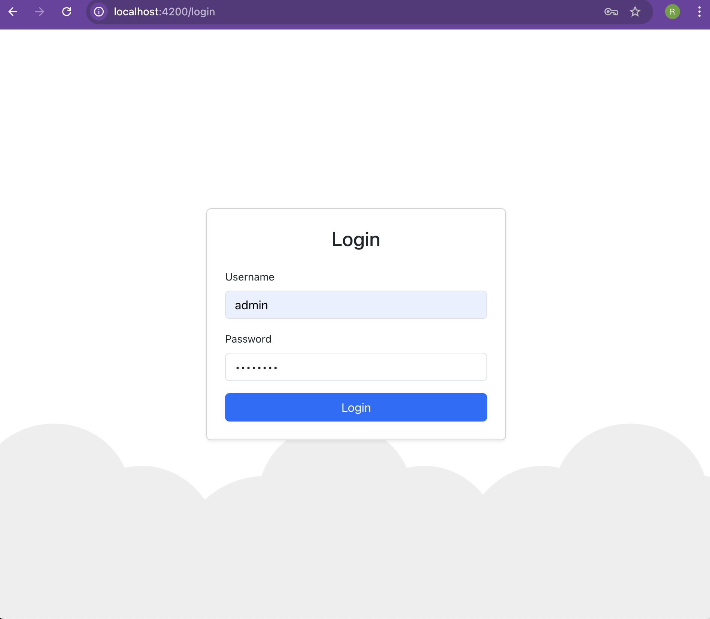
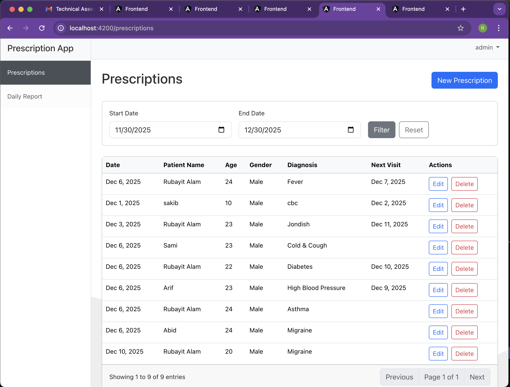
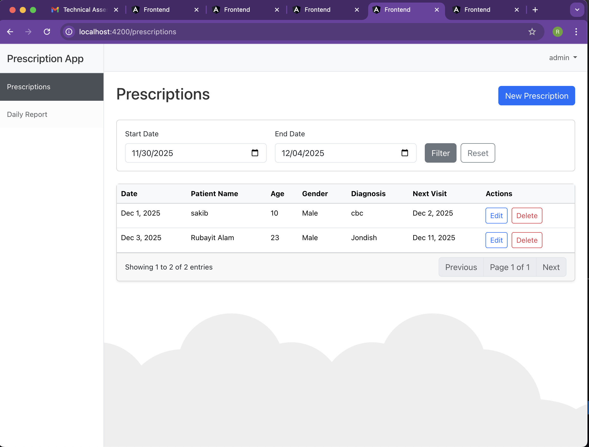
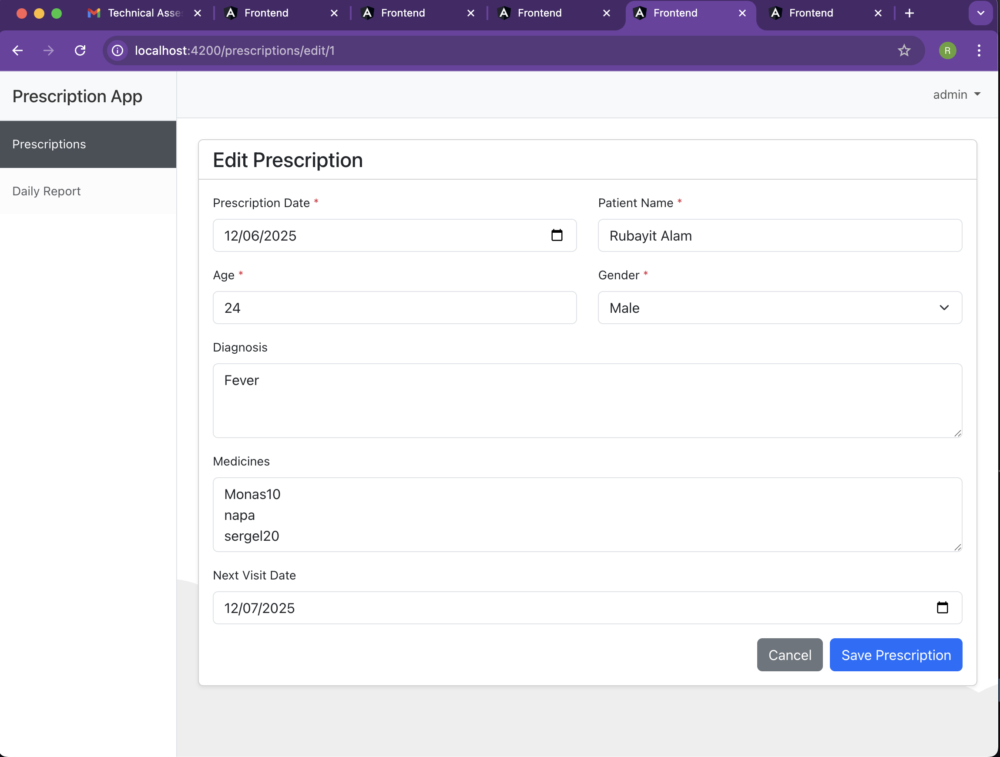
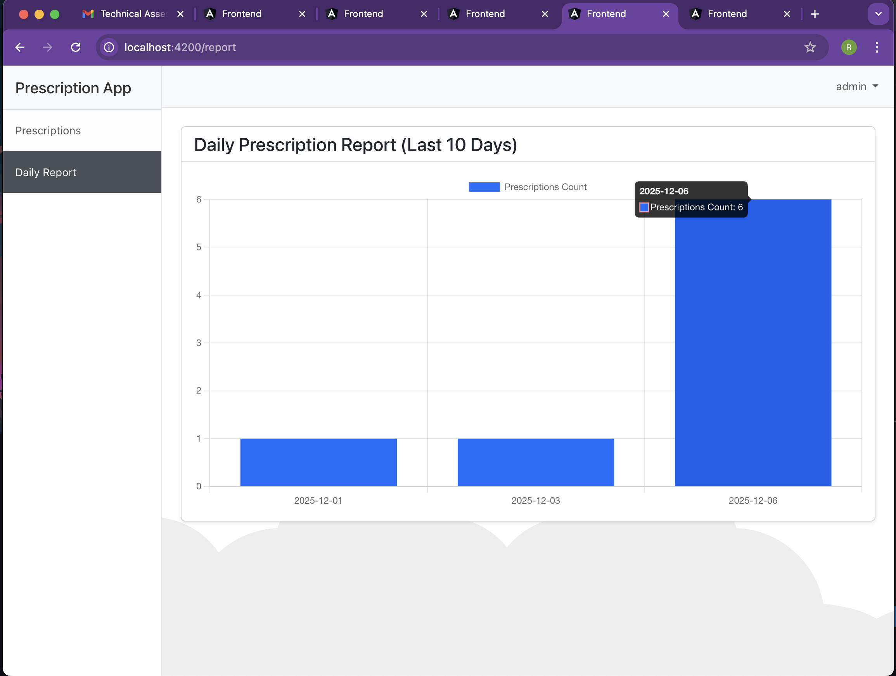

# -Prescription-Management-Application
A full-stack web application for managing prescriptions, built with Spring Boot and Angular.

## Screenshots

### Login Page


### Prescription List


### Add Prescription Form


### Edit Prescription Form


### Prescription Chart (Last 10 Days)

## Tech Stack

### Backend
- Java 17
- Spring Boot 3.2.0
- Spring Security (Basic Auth)
- Spring Data JPA
- H2 Database (In-memory, persists to file)
- Lombok
- Swagger UI

### Frontend
- Angular 16
- Bootstrap 5
- Chart.js (ng2-charts)

## Prerequisites
- Java 17+
- Node.js 16+
- Maven (optional, wrapper included if generated, but standard `mvn` used here)

## Setup & Run

### 1. Backend
Navigate to the `backend` directory:
```bash
cd backend
```

Run the application:
```bash
# If you have maven installed
mvn spring-boot:run

# Or use the wrapper if available (not included in this scratch setup but standard practice)
# ./mvnw spring-boot:run
```
The backend will start on `http://localhost:8080`.
- **Swagger UI**: `http://localhost:8080/swagger-ui.html`
- **H2 Console**: `http://localhost:8080/h2-console` (JDBC URL: `jdbc:h2:file:./data/prescriptiondb`, User: `sa`, Password: `password`)

**Default Credentials**:
- Username: `admin`
- Password: `admin123`

### 2. Frontend
Navigate to the `frontend` directory:
```bash
cd frontend
```

Install dependencies:
```bash
npm install
```

Run the application:
```bash
ng serve
```
The frontend will start on `http://localhost:4200`.

## Features
- **Authentication**: Secure login (no anonymous access).
- **Prescription Management**: Create, Read, Update, Delete prescriptions.
- **Filtering**: Filter prescriptions by date range.
- **Reporting**: View a bar chart of prescription counts for the last 10 days.
- **Validation**: Form validation for all inputs.
- **Pagination**: Server-side pagination for prescription list.

## Project Structure
- `backend/`: Spring Boot source code.
- `frontend/`: Angular source code.
